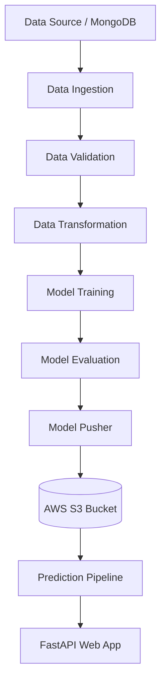

<div align="center">
  <h1>🚗 Vehicle Insurance Prediction – End-to-End MLOps Pipeline</h1>
  <p>An industry-grade Machine Learning project implementing a complete MLOps pipeline for predicting whether a customer will purchase vehicle insurance.</p>
  
  <p>
    
    
    
    
    
  </p>
</div>

---

## 📌 Problem Statement

Insurance companies often struggle to identify **which customers are likely to purchase vehicle insurance**. 

Using machine learning, this system predicts **customer purchase intent**, enabling companies to:
- Target high-probability customers.
- Optimize marketing campaigns and reduce acquisition costs.
- Increase overall insurance conversion rates.

---

## ⭐ Project Highlights

This project demonstrates **production-ready ML engineering practices**:

- ✔ **End-to-End Machine Learning Pipeline** (Ingestion, Validation, Transformation, Training, Evaluation, Pusher)
- ✔ **CI/CD Automation** with GitHub Actions
- ✔ **Dockerized ML Application** for consistent deployments
- ✔ **AWS S3** for model artifact storage & versioning
- ✔ **AWS ECR** for container registry management
- ✔ **MongoDB** integration for data storage
- ✔ **FastAPI** backend for high-performance model serving
- ✔ Modular, scalable, and config-driven architecture
- ✔ Comprehensive logging & exception handling

---

## 🏗 System Architecture



---

## 🛠 Tech Stack

| Category | Technologies |
|---|---|
| **Programming** | Python |
| **Machine Learning** | Scikit-learn, Pandas, NumPy, Imbalanced-learn |
| **Data Visualization** | Matplotlib, Seaborn, Plotly |
| **Backend Framework** | FastAPI, Uvicorn, Jinja2 |
| **Database** | MongoDB (PyMongo) |
| **MLOps & Cloud** | Docker, GitHub Actions, AWS S3 (Boto3), AWS IAM, AWS ECR |

---

## ⚙️ ML Pipeline Stages

1. **Data Ingestion:** Fetches raw dataset from MongoDB, stores it in a feature store, and splits it into train/test sets.
2. **Data Validation:** Performs schema validation, missing value checks, and data consistency verification.
3. **Data Transformation:** Handles feature engineering, categorical encoding, numerical scaling, and saves the preprocessing pipeline.
4. **Model Training:** Trains the machine learning model, configures hyperparameters, and saves the trained model artifact.
5. **Model Evaluation:** Evaluates model performance and prevents poor-performing models from being deployed.
6. **Model Pusher:** Pushes the validated, trained model artifacts to AWS S3 for production use.

---

## 🚀 Getting Started

### Prerequisites
- Python 3.8+
- Docker (optional, for containerized run)
- AWS Account (for S3 and ECR)
- MongoDB URI

### Installation

1. **Clone the repository:**
   ```bash
   git clone https://github.com/Rupeshbhardwaj002/Vehicle-insurance-.git
   cd Vehicle-insurance-
   ```

2. **Create a virtual environment and activate it:**
   ```bash
   python -m venv venv
   source venv/bin/activate  # On Windows use `venv\Scripts\activate`
   ```

3. **Install dependencies:**
   ```bash
   pip install -r requirements.txt
   ```

4. **Run the FastAPI application locally:**
   ```bash
   python app.py
   ```
   *The app will be available at `http://localhost:8000` (or the port specified in your config).*

---

## 🐳 Docker Containerization

You can easily run the application using Docker:

1. **Build the Docker Image:**
   ```bash
   docker build -t vehicle-insurance .
   ```

2. **Run the Docker Container:**
   ```bash
   docker run -p 8000:8000 vehicle-insurance
   ```

---

## ☁️ AWS Cloud & CI/CD Integration

This project integrates with AWS services to support production ML deployment via **GitHub Actions**.

- **AWS S3:** Model artifact storage and versioning.
- **AWS IAM:** Secure access control and permissions.
- **AWS ECR:** Docker container registry for storing built images.

**CI/CD Pipeline (`.github/workflows/aws.yaml`):**
1. Triggers on push to the `main` branch.
2. Builds the Docker image.
3. Pushes the Docker image to AWS ECR.
4. Deploys the updated pipeline.
5. Stores model artifacts securely in AWS S3.

---

## 📂 Project Structure

```bash
Vehicle-Insurance-Pipeline
│
├── .github/workflows/aws.yaml      # CI/CD workflow
├── src/
│   ├── components/                 # Core ML pipeline steps
│   ├── pipeline/                   # Training & Prediction pipelines
│   ├── cloud_storage/              # AWS S3 integration
│   ├── configuration/              # AWS & MongoDB connections
│   ├── entity/                     # Config & Artifact entities
│   └── utils/                      # Helper functions
├── config/                         # Schema and model configurations
├── artifact/                       # Local training artifacts
├── logs/                           # Pipeline execution logs
├── notebook/                       # Jupyter notebooks for EDA
├── templates/                      # HTML templates for FastAPI
├── static/                         # CSS/JS static files
├── Dockerfile                      # Docker configuration
├── app.py                          # FastAPI application entry point
├── requirements.txt                # Python dependencies
└── setup.py                        # Package setup
```

---

## 👨‍💻 Author

**Rupesh Bhardwaj**  
*AI / Machine Learning Engineer*  
Focused on Machine Learning, Deep Learning, and MLOps Systems.

[](https://github.com/Rupeshbhardwaj002)

