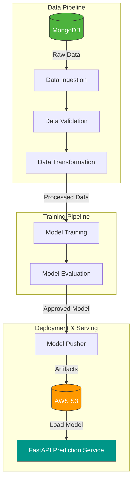
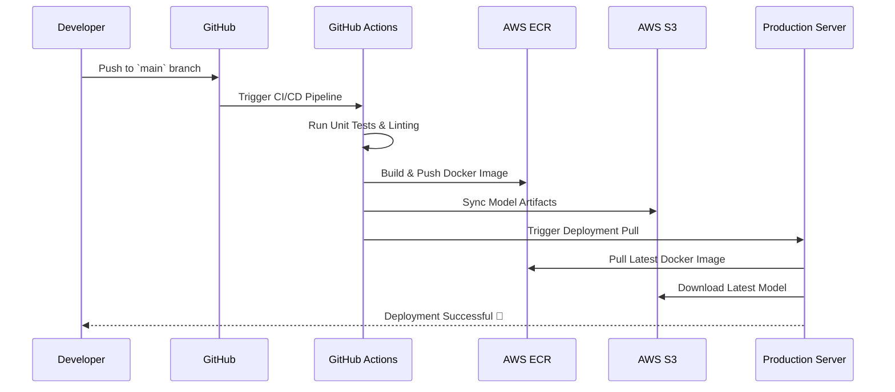

---
<div align="center">
  <h1>🚗 Vehicle Insurance Prediction</h1>
  <h3>Enterprise-Grade MLOps Pipeline & Prediction System</h3>
  
  <p>
    
    
    
    
    
  </p>
</div>

---

## 📖 Executive Summary

Insurance companies invest heavily in customer acquisition. This project provides an **end-to-end Machine Learning solution** to predict whether a customer is likely to purchase vehicle insurance. By identifying high-probability prospects, businesses can optimize marketing spend, personalize outreach, and significantly improve conversion rates.

Built with a focus on **scalability and automation**, this repository demonstrates a complete **MLOps lifecycle**—from data ingestion to cloud deployment.

---

## 🏗️ System Architecture & Data Flow

The system is designed with a modular architecture, ensuring separation of concerns between data processing, model training, and serving.



---

## 🔄 MLOps CI/CD Workflow

Continuous Integration and Continuous Deployment (CI/CD) are fully automated using **GitHub Actions**, ensuring that every code change is tested, containerized, and deployed seamlessly to AWS.



---

## ⚙️ Pipeline Components

| Stage | Description | Technologies |
|-------|-------------|--------------|
| **1. Ingestion** | Extracts raw data from MongoDB, splits into train/test sets, and stores in the feature store. | `PyMongo`, `Pandas` |
| **2. Validation** | Enforces data schema, detects anomalies, and handles missing values. | `Scipy`, `Custom Scripts` |
| **3. Transformation** | Feature engineering, SMOTE for class imbalance, scaling, and encoding. | `Scikit-Learn`, `Imbalanced-Learn` |
| **4. Training** | Hyperparameter tuning and model training using optimized algorithms. | `Scikit-Learn`, `XGBoost` |
| **5. Evaluation** | Compares new model against the currently deployed model. Deploys only if performance improves. | `Scikit-Learn Metrics` |
| **6. Pusher** | Uploads the validated model artifacts (`model.pkl`, `preprocessor.pkl`) to cloud storage. | `Boto3` (AWS S3) |

---


## 📂 Project Structure

```bash
Vehicle-Insurance-Pipeline
│
├── .github/workflows/aws.yaml      # CI/CD workflow
├── src/
│   ├── components/                 # Core ML pipeline steps
│   ├── pipeline/                   # Training & Prediction pipelines
│   ├── cloud_storage/              # AWS S3 integration
│   ├── configuration/              # AWS & MongoDB connections
│   ├── entity/                     # Config & Artifact entities
│   └── utils/                      # Helper functions
├── config/                         # Schema and model configurations
├── artifact/                       # Local training artifacts
├── logs/                           # Pipeline execution logs
├── notebook/                       # Jupyter notebooks for EDA
├── templates/                      # HTML templates for FastAPI
├── static/                         # CSS/JS static files
├── Dockerfile                      # Docker configuration
├── app.py                          # FastAPI application entry point
├── requirements.txt                # Python dependencies
└── setup.py                        # Package setup
```

## 🚀 Getting Started

### Local Development Setup

1. **Clone the repository:**
   ```bash
   git clone https://github.com/Rupeshbhardwaj002/Vehicle-insurance-.git
   cd Vehicle-insurance-
   ```

2. **Environment Configuration:**
   Create a `.env` file in the root directory and add your credentials:
   ```env
   MONGO_DB_URL="your_mongodb_connection_string"
   AWS_ACCESS_KEY_ID="your_aws_access_key"
   AWS_SECRET_ACCESS_KEY="your_aws_secret_key"
   AWS_REGION="your_aws_region"
   ```

3. **Install Dependencies:**
   ```bash
   python -m venv venv
   source venv/bin/activate  # Windows: venv\Scripts\activate
   pip install -r requirements.txt
   ```

4. **Run the Application:**
   ```bash
   python app.py
   ```
   *API Documentation (Swagger UI) will be available at `http://localhost:8000/docs`.*

---

## 🐳 Docker Deployment

For isolated and consistent environments, use Docker:

```bash
# Build the image
docker build -t vehicle-insurance-api .

# Run the container
docker run -p 8000:8000 --env-file .env vehicle-insurance-api
```

---

## 📡 API Reference

The prediction service exposes a RESTful API via FastAPI.

**Endpoint:** `POST /predict`

**Sample Request Payload:**
```json
{
  "Gender": "Male",
  "Age": 35,
  "Driving_License": 1,
  "Region_Code": 28,
  "Previously_Insured": 0,
  "Vehicle_Age": "1-2 Year",
  "Vehicle_Damage": "Yes",
  "Annual_Premium": 45000,
  "Policy_Sales_Channel": 124,
  "Vintage": 150
}
```

**Sample Response:**
```json
{
  "prediction": 1,
  "probability": 0.87,
  "message": "Customer is highly likely to purchase vehicle insurance."
}
```

---

## 👨‍💻 Author

**Rupesh Bhardwaj**  
*AI / Machine Learning Engineer*  
Passionate about building scalable Machine Learning systems, Deep Learning architectures, and robust MLOps pipelines.

[](https://github.com/Rupeshbhardwaj002)


